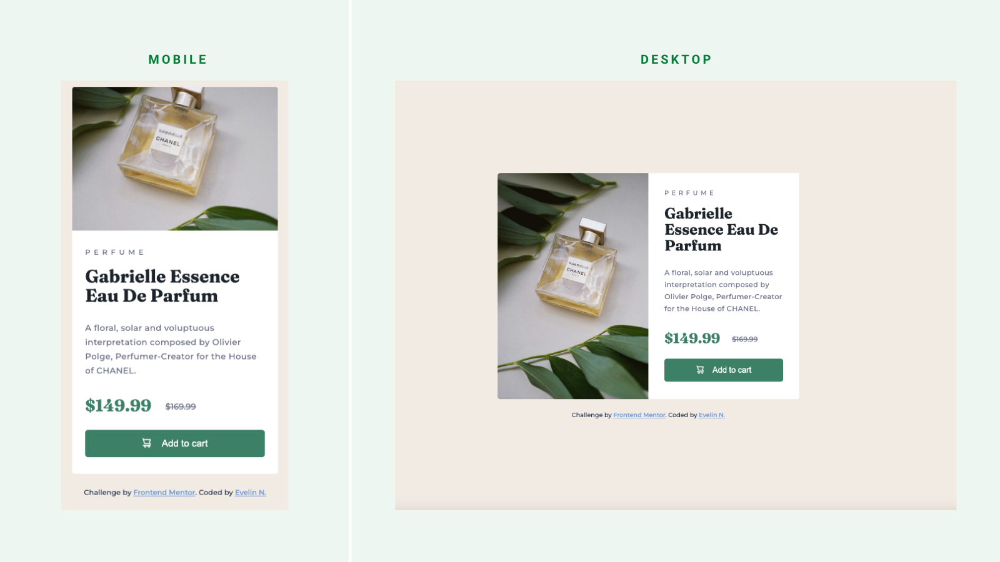

# Frontend Mentor - Product preview card component solution

This is a solution to the [Product preview card component challenge on Frontend Mentor](https://www.frontendmentor.io/challenges/product-preview-card-component-GO7UmttRfa). Frontend Mentor challenges help you improve your coding skills by building realistic projects.

### Preview

### Video

https://user-images.githubusercontent.com/107203586/189934409-a154bc32-6686-48a4-9204-61ff68207438.mov

### Links

 
- Live Site URL: [dev-evelin-product-preview-card-compo.netlify.app](https://your-live-site-url.com)

### Built with

- Semantic HTML5 markup
- CSS custom properties
- Flexbox
- CSS Grid
- Mobile-first workflow

## Author

- Frontend Mentor - [@dev-evelin](https://www.frontendmentor.io/profile/dev-evelin)
- Twitter - [@dev*evelin*](https://twitter.com/dev_evelin_)
